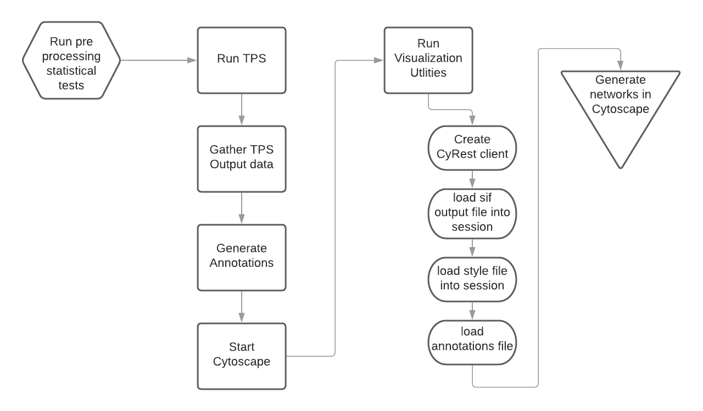

# TPS Pipeline

**TPS workflow overview**

The TPS/workflow module utilizes the TPS repository structure in order to run the TPS software end-to-end in order to produce Cytoscape sessions. 

## Documentation

- `TPS.sh`
  - Runs TPS software 
  - sets up and initializes workspace environment `py2cyto_envirnment`
  - calls driver script `main.py`

- `main.py`
  - redirects TPS output files
  - calls utility functions for processing network annotations
  - calls visualization utilities
  
- `visualization_utilities.py`
  - utility functions used for creating cyREST client 
  - import output graph files, style, and annotations into Cytoscape
  
- `table_refactor.py`
  - helper methods of reformatting annotations data

- `table_generation.py`
  - helper methods for combining data sources to prepare annotations table for proteins that can be imported into Cytoscape

## Usage

In order to run pipeline, call

`bash TPS.sh` 

from workflow directory

**Note**: within `main.py`, change this [line](https://github.com/ajshedivy/tps/blob/visualization_v2/workflow/main.py#L70) to the install directory of Cytoscape on your machine

Example: `users/programs/Cytoscape_v3.7.1`

## Output 

With folder `TPS/results`, a time stamped folder is created with the following files:
* Cytoscape session file
* annotations data CSV
* original annotations file (no refactoring)
